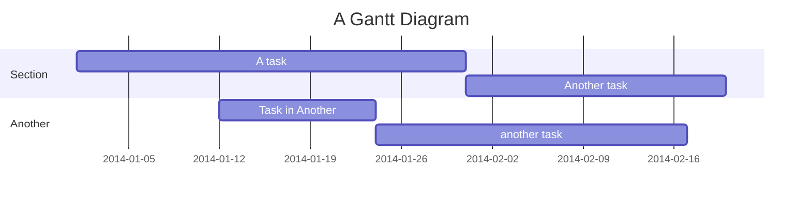

# Demo




<br-page/>

> [!NOTE]
> Useful information that users should know, even when skimming content.


> [!TIP]
> Helpful advice for doing things better or more easily.


> [!IMPORTANT]
> Key information users need to know to achieve their goal.


> [!WARNING]
> Urgent info that needs immediate user attention to avoid problems.

<br-page/>

## HTML comment tags

Code:

```
Here's a paragraph that will be visible.

<!-- This is a comment that will be hidden. -->

<!-- 

This is a comment that will
be hidden.

-->

```

Here's a paragraph that will be visible.

<!-- This is a comment that will be hidden. -->

<!-- 

This is a comment that will
be hidden.

-->

And here's another paragraph that's visible.


## Markdown comments

Code:

```
Here's a paragraph that will be visible.

[This is a comment that will be hidden.]: #

And here's another paragraph that's visible.
```

Rendered:

Here's a paragraph that will be visible.

[This is a comment that will be hidden.]: #

And here's another paragraph that's visible.

## Weird comments

Code:

```
[//]: # (This syntax works like a comment, and won't appear in any output.)
[//]: # (It’s a little bizarre, but it works with MacDown and Pandoc.)
```

Rendered:

[//]: # (This syntax works like a comment, and won't appear in any output.)
[//]: # (It’s a little bizarre, but it works with MacDown and Pandoc.)
